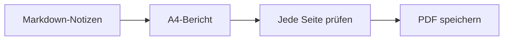

# Wöchentlicher Entwicklungsbericht

Für die Besprechung im Team. Dieses Beispiel nutzt ein A4-Layout und behält auswählbaren Text in der PDF bei.

## Fortschritt dieser Woche

- [x] Freigabe-Checkliste prüfen
- [x] Dokumentation abschließen
- [ ] Abschlussbericht teilen

| Bereich | Status | Nächster Schritt |
| --- | --- | --- |
| Dokumentation | Fertig | Im Team prüfen |
| Darstellung | Fertig | PDF prüfen |
| Veröffentlichung | In Arbeit | Checkliste bestätigen |

## Übergabeablauf



## Eine kleine Berechnung

Wenn $a$ von $b$ Aufgaben erledigt sind, beträgt der Fertigstellungsanteil:

$$
r = \frac{a}{b}
$$

## Codebeispiel

```javascript
const report = {
  title: "Wöchentlicher Entwicklungsbericht",
  status: "Bereit zur Prüfung"
};
console.log(report.title);
```

> Ersetze dieses Beispiel durch eigene Notizen und prüfe die Ausgabe vor dem Teilen.
