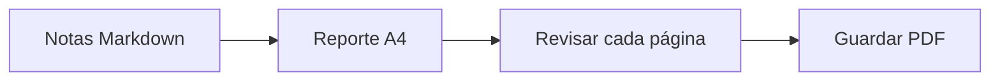

# Reporte semanal de ingeniería

Preparado para la revisión del equipo. Este ejemplo usa formato A4 y conserva el texto seleccionable en el PDF.

## Avances de la semana

- [x] Revisar la lista de lanzamiento
- [x] Completar la documentación
- [ ] Compartir el reporte final

| Área | Estado | Siguiente paso |
| --- | --- | --- |
| Documentación | Lista | Revisar con el equipo |
| Generación | Lista | Verificar el PDF |
| Lanzamiento | En curso | Confirmar la lista |

## Flujo de entrega



## Un cálculo sencillo

Si se completaron $a$ de $b$ tareas, la proporción es:

$$
r = \frac{a}{b}
$$

## Ejemplo de código

```javascript
const reporte = {
  titulo: "Reporte semanal de ingeniería",
  estado: "Listo para revisión"
};
console.log(reporte.titulo);
```

> Adapta este ejemplo a tus notas y revisa el resultado antes de compartirlo.
