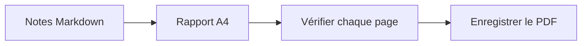

# Rapport technique hebdomadaire

Préparé pour la revue en équipe. Cet exemple utilise une mise en page A4 et conserve le texte sélectionnable dans le PDF.

## Avancement de la semaine

- [x] Vérifier la liste de publication
- [x] Terminer la documentation
- [ ] Partager le rapport final

| Domaine | État | Étape suivante |
| --- | --- | --- |
| Documentation | Prêt | Relire en équipe |
| Rendu | Prêt | Vérifier le PDF |
| Publication | En cours | Confirmer la liste |

## Processus de livraison



## Un petit calcul

Si $a$ éléments sur $b$ sont terminés, le taux d’achèvement est :

$$
r = \frac{a}{b}
$$

## Exemple de code

```javascript
const report = {
  title: "Rapport technique hebdomadaire",
  status: "Prêt pour relecture"
};
console.log(report.title);
```

> Adaptez cet exemple à vos notes, puis vérifiez le résultat avant de le partager.
