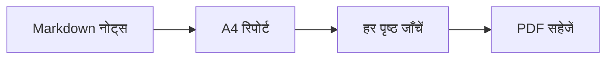

# साप्ताहिक इंजीनियरिंग रिपोर्ट

टीम समीक्षा के लिए तैयार। यह उदाहरण A4 लेआउट का उपयोग करता है और PDF में टेक्स्ट चुना जा सकता है।

## इस सप्ताह की प्रगति

- [x] रिलीज़ की जाँच सूची देखें
- [x] दस्तावेज़ पूरे करें
- [ ] अंतिम रिपोर्ट साझा करें

| क्षेत्र | स्थिति | अगला कदम |
| --- | --- | --- |
| दस्तावेज़ | तैयार | टीम के साथ समीक्षा |
| रेंडरिंग | तैयार | PDF जाँचें |
| रिलीज़ | काम जारी है | जाँच सूची की पुष्टि करें |

## रिपोर्ट तैयार करने की प्रक्रिया



## एक छोटी गणना

यदि $b$ में से $a$ कार्य पूरे हैं, तो पूरा होने का अनुपात है:

$$
r = \frac{a}{b}
$$

## कोड का उदाहरण

```javascript
const report = {
  title: "साप्ताहिक इंजीनियरिंग रिपोर्ट",
  status: "समीक्षा के लिए तैयार"
};
console.log(report.title);
```

> इस उदाहरण को अपने नोट्स से अपडेट करें और साझा करने से पहले परिणाम जाँचें।
