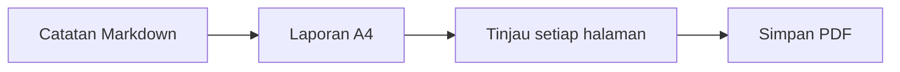

# Laporan teknik mingguan

Disiapkan untuk tinjauan tim. Contoh ini memakai tata letak A4 dan teks dalam PDF tetap dapat dipilih.

## Kemajuan minggu ini

- [x] Tinjau daftar periksa rilis
- [x] Selesaikan dokumentasi
- [ ] Bagikan laporan akhir

| Bidang | Status | Langkah berikutnya |
| --- | --- | --- |
| Dokumentasi | Siap | Tinjau bersama tim |
| Rendering | Siap | Periksa PDF |
| Rilis | Sedang dikerjakan | Konfirmasi daftar periksa |

## Alur penyampaian



## Perhitungan sederhana

Jika $a$ dari $b$ tugas selesai, rasio penyelesaiannya adalah:

$$
r = \frac{a}{b}
$$

## Contoh kode

```javascript
const report = {
  title: "Laporan teknik mingguan",
  status: "Siap ditinjau"
};
console.log(report.title);
```

> Ganti contoh ini dengan catatan Anda, lalu periksa hasilnya sebelum dibagikan.
