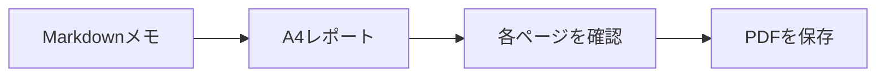

# 週間開発レポート

チームレビュー用のサンプルです。A4レイアウトを使用し、PDF内の文字は選択できます。

## 今週の進捗

- [x] リリースのチェックリストを確認
- [x] ドキュメントを完成
- [ ] 最終レポートを共有

| 分野 | 状態 | 次のステップ |
| --- | --- | --- |
| ドキュメント | 完了 | チームでレビュー |
| 描画 | 完了 | PDFを確認 |
| リリース | 進行中 | チェックリストを確認 |

## 共有までの流れ



## 簡単な計算

$b$件のうち$a$件が完了した場合、完了率は次のとおりです。

$$
r = \frac{a}{b}
$$

## コード例

```javascript
const report = {
  title: "週間開発レポート",
  status: "レビュー待ち"
};
console.log(report.title);
```

> このサンプルを自分のメモに置き換え、共有前に出力を確認してください。
