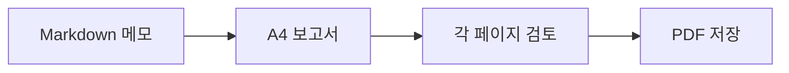

# 주간 개발 보고서

팀 검토를 위한 예제입니다. A4 레이아웃을 사용하며 PDF에서 텍스트를 선택할 수 있습니다.

## 이번 주 진행 상황

- [x] 출시 체크리스트 검토
- [x] 문서 작성 완료
- [ ] 최종 보고서 공유

| 분야 | 상태 | 다음 단계 |
| --- | --- | --- |
| 문서 | 완료 | 팀과 검토 |
| 렌더링 | 완료 | PDF 확인 |
| 출시 | 진행 중 | 체크리스트 확인 |

## 전달 과정



## 간단한 계산

$b$개 중 $a$개 항목을 완료했다면 완료 비율은 다음과 같습니다.

$$
r = \frac{a}{b}
$$

## 코드 예제

```javascript
const report = {
  title: "주간 개발 보고서",
  status: "검토 준비 완료"
};
console.log(report.title);
```

> 이 예제를 자신의 메모로 바꾸고 공유하기 전에 결과를 확인하세요.
