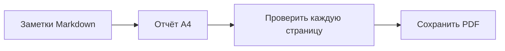

# Еженедельный инженерный отчёт

Подготовлено для обсуждения в команде. В этом примере используется макет A4, а текст PDF можно выделять.

## Прогресс за неделю

- [x] Проверить список выпуска
- [x] Завершить документацию
- [ ] Поделиться итоговым отчётом

| Область | Статус | Следующий шаг |
| --- | --- | --- |
| Документация | Готово | Обсудить с командой |
| Отображение | Готово | Проверить PDF |
| Выпуск | В работе | Подтвердить список |

## Процесс подготовки



## Небольшой расчёт

Если выполнено $a$ из $b$ задач, доля завершённых задач равна:

$$
r = \frac{a}{b}
$$

## Пример кода

```javascript
const report = {
  title: "Еженедельный инженерный отчёт",
  status: "Готово к проверке"
};
console.log(report.title);
```

> Замените этот пример своими заметками и проверьте результат перед отправкой.
