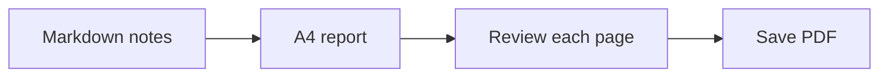

# Weekly engineering report

Prepared for the team review. This example uses one A4 layout and keeps document text selectable in the PDF.

## This week's progress

- [x] Review the release checklist
- [x] Finish the documentation
- [ ] Share the final report

| Area | Status | Next step |
| --- | --- | --- |
| Documentation | Ready | Review with the team |
| Rendering | Ready | Check the PDF |
| Release | In progress | Confirm the checklist |

## Delivery flow



## A small calculation

If $a$ items out of $b$ are complete, the completion ratio is:

$$
r = \frac{a}{b}
$$

## Code example

```javascript
const report = {
  title: "Weekly engineering report",
  status: "Ready for review"
};
console.log(report.title);
```

> Update this example with your own notes, then review the output before sharing it.
