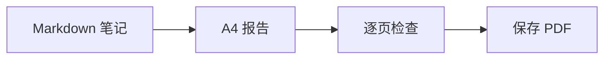

# 每周工程报告

供团队周会使用。本示例采用一套 A4 版式，PDF 中的正文文字可以选择和复制。

## 本周进展

- [x] 检查发布清单
- [x] 完成文档整理
- [ ] 分享最终报告

| 工作项 | 状态 | 下一步 |
| --- | --- | --- |
| 文档 | 已完成 | 团队复核 |
| 渲染 | 已完成 | 检查 PDF |
| 发布 | 进行中 | 确认清单 |

## 交付流程



## 简单计算

如果 $b$ 项工作中完成了 $a$ 项，则完成比例为：

$$
r = \frac{a}{b}
$$

## 代码示例

```javascript
const report = {
  title: "每周工程报告",
  status: "待团队复核"
};
console.log(report.title);
```

> 可以把示例替换为自己的内容，检查输出后再分享给团队。
