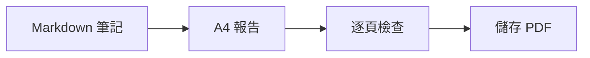

# 每週工程報告

供團隊審閱的範例。使用 A4 版面，PDF 中的文字仍可選取。

## 本週進度

- [x] 檢查發佈清單
- [x] 完成文件
- [ ] 分享最終報告

| 項目 | 狀態 | 下一步 |
| --- | --- | --- |
| 文件 | 已完成 | 與團隊審閱 |
| 呈現 | 已完成 | 檢查 PDF |
| 發佈 | 進行中 | 確認清單 |

## 交付流程



## 簡單計算

若 $b$ 個項目中完成了 $a$ 個，完成比例為：

$$
r = \frac{a}{b}
$$

## 程式碼範例

```javascript
const report = {
  title: "每週工程報告",
  status: "待審閱"
};
console.log(report.title);
```

> 用自己的筆記更新此範例，分享前請先檢查輸出。
